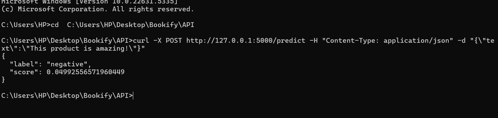
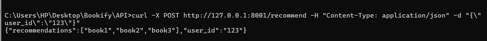
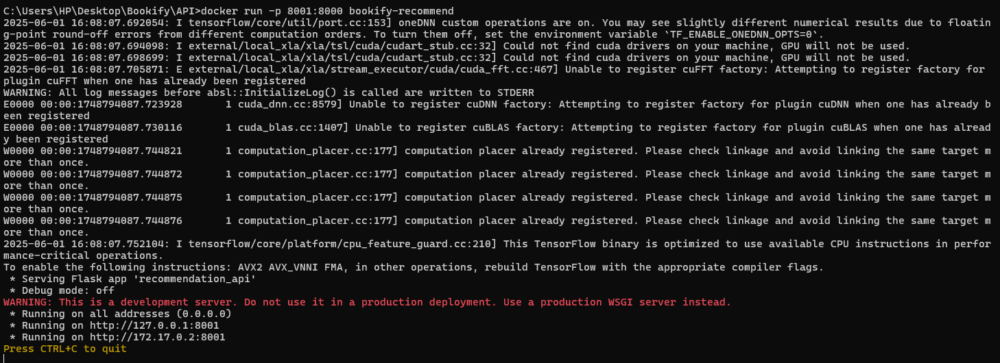
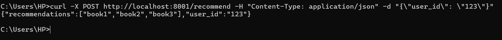
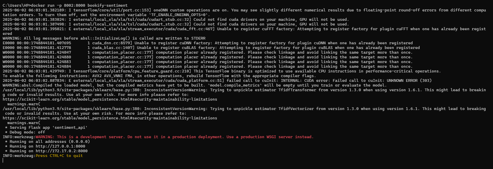
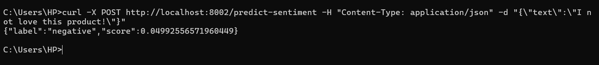
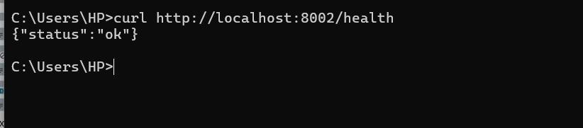

# Sentiment Analysis REST API

This project provides a Flask REST API to serve a sentiment analysis model with TF-IDF preprocessing.

## Project Structure

- `main.py`: Flask app entry point with `/predict` endpoint.
- `model_loader.py`: Loads the saved model and TF-IDF vectorizer.
- `preprocess.py`: Preprocessing functions for input text.
- `requirements.txt`: Python dependencies.

## Setup & Run

1. Create and activate a virtual environment:

```bash
python -m venv obs
obs\Scripts\activate
```
**Sentiment.py result**



**Recommendation.py output**
```bash
curl -X POST http://localhost:8001/recommend -H "Content-Type: application/json" -d "{\"user_id\": \"123\"}"
```


**Recommendation_api docker image**
```bash
(obs) PS C:\Users\HP\Desktop\Bookify\API> docker build -t bookify-recommend .
```
```bash
(obs) PS C:\Users\HP\Desktop\Bookify\API> docker run -p 8001:8000 bookify-recommend
```


Docker results
```bash
curl -X POST http://localhost:8001/recommend -H "Content-Type: application/json" -d "{\"user_id\": \"123\"}"
```


**Sentiment_api docker image**
```bash
(obs) PS C:\Users\HP\Desktop\Bookify> docker build -t bookify-sentiment -f "API/Dockerfile(sentiment)" .
```
```bash
docker run -p 8002:8000 bookify-sentiment
```
!

Docker results for sentiment
```bash
curl -X POST http://localhost:8002/predict-sentiment -H "Content-Type: application/json" -d "{\"text\":\"I love this product!\"}"
```


Result for health
```bash
curl http://localhost:8002/health
```
